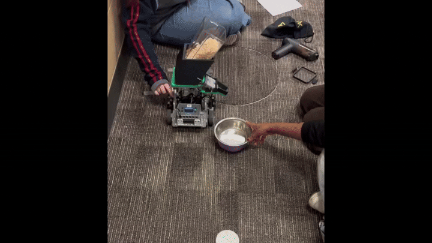
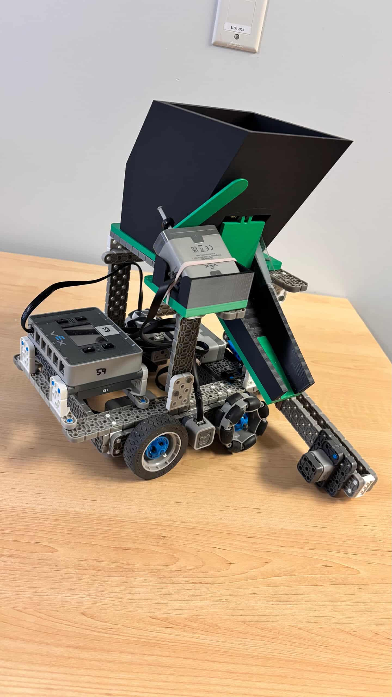
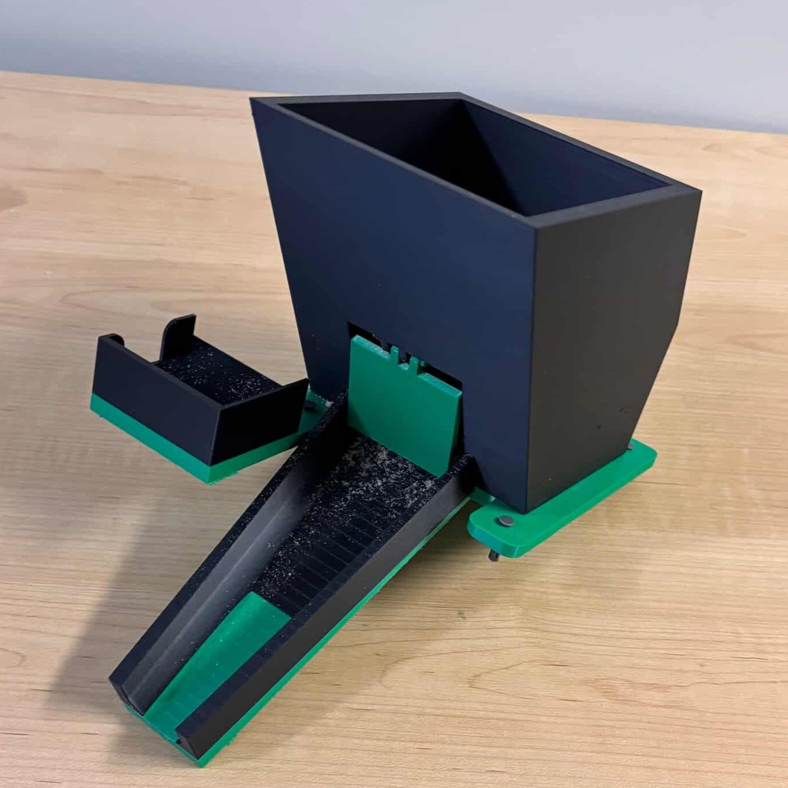

# Autonomous Pet Food Dispensing Robot

A VEX-based autonomous robot that detects pet bowls, identifies bowl colour, dispenses different food portions, skips obstacles, and returns to its starting position.

  

## What it does

The robot drives beside a row of pet bowls and uses a bumper sensor to detect when it has reached an object. It then uses an optical sensor to check the object’s colour.

- Blue bowl: dispenses a smaller portion
- Purple bowl: dispenses a larger portion
- Other objects: skips without dispensing

After filling the programmed number of bowls, the robot raises its bumper arm and reverses back to its starting position.

## How it works

The robot uses:

- VEX V5 motors for driving, lever movement, and trapdoor control
- A bumper sensor to detect bowls/objects
- An optical sensor to read bowl hue
- A Touch LED to start the routine
- Motor encoders to return home
- A 3D-printed food holder, chute, and trapdoor mechanism

  

## Software

The C++ code is split into functions for each part of the routine:

| Function | Purpose |
|---|---|
| `startRoutine()` | Runs the full feeding sequence |
| `moveUntilBumper()` | Drives forward until the bumper is pressed |
| `detectColor()` | Reads the bowl hue and chooses the dispense time |
| `releaseFood()` | Opens the trapdoor for the selected duration |
| `afterDetection()` | Moves past the detected bowl/object |
| `moveHome()` | Returns the robot to its starting position |

## My Contributions

I mainly worked on the robot’s software, including the main routine, return-home logic, and post-detection movement. I also helped integrate the sensors and motors into the final autonomous sequence.

## Challenges

Some of the main issues were:

- Optical sensor readings changed depending on lighting
- The robot did not always drive perfectly straight
- Food sometimes jammed or spilled because of the trapdoor/chute design

## Tech Used

- C++
- VEXcode
- VEX V5
- Optical sensor
- Bumper sensor
- Motor encoders
- SolidWorks
- 3D printing
